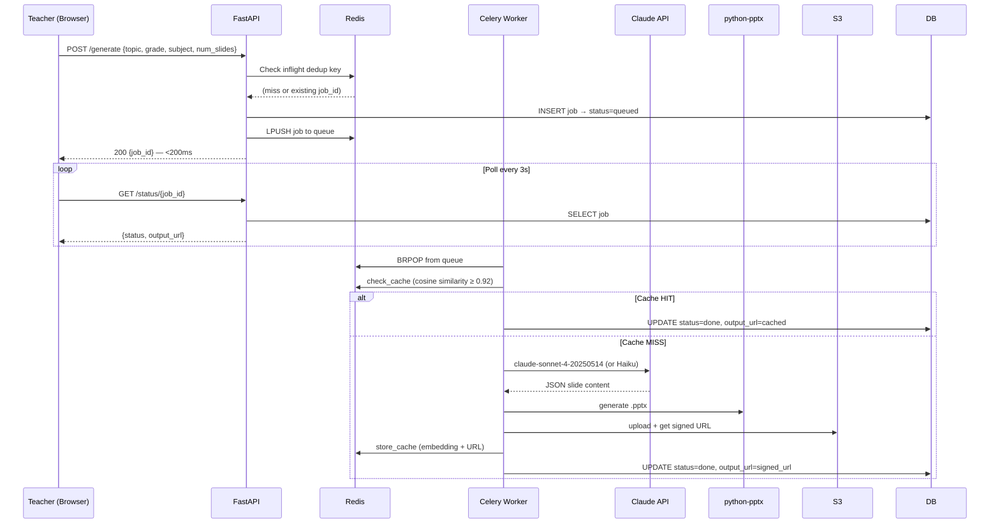

# Architecture Design Document — Savra PPT Generator

## 1. System Design

### Request Flow



### Component Map

| Component | Technology | Role |
|---|---|---|
| API Gateway | FastAPI + uvicorn | HTTP entry point, rate limiting, routing |
| Job Queue | Celery + Redis | Async task dispatch |
| Semantic Cache | Redis + sentence-transformers | Avoid redundant LLM calls |
| LLM | Anthropic Claude | Slide content generation |
| PPTX Engine | python-pptx | Assembles .pptx from JSON |
| Object Store | AWS S3 | Stores generated files, signed URLs |
| Database | PostgreSQL asyncpg | Job records, status tracking |
| Frontend | Vite + React + Tailwind | Teacher-facing form + status poller |

---

## 2. Cost Reduction Strategy

### Levers Applied

**A. Semantic Cache (highest impact)**
- Cache key = `sentence-transformers/all-MiniLM-L6-v2` embedding of request text
- Cosine similarity threshold: 0.92 (configurable via env var)
- Same topic, different phrasing → cache hit → ₹0 LLM cost
- TTL: 30 days (educational content is stable)

**B. Smart Model Routing**
- Simple factual topics (history, geography, civics, dates, events) with ≤8 slides → Haiku
- Haiku cost: ~₹2/PPT vs Sonnet ~₹5/PPT
- Routing ~30% of requests saves ₹3/request on those jobs

**C. Anthropic Prompt Caching**
- System prompt cached with `cache_control: ephemeral`
- Reduces input token cost ~10% immediately (Anthropic charges cached tokens at 10% of base price)

### Cost Math (10,000 users · 50% teachers)

```
5,000 teachers × 2 PPTs/week × 4.3 weeks = 43,000 PPTs/month

Current system:  43,000 × ₹15               = ₹6,45,000/month

New system:
  35% cache hits     → 27,950 actual LLM calls
  30% Haiku routing  →  8,385 Haiku  @ ₹2   = ₹16,770
  70% Sonnet         → 19,565 Sonnet @ ₹5   = ₹97,825
  Total:             ~₹1,14,595/month

  Savings: ~82% reduction (₹5,30,405/month saved)
```

---

## 3. Reliability Plan

### Failure Matrix

| Failure | Detection | Response |
|---|---|---|
| Claude 503 / timeout | `anthropic.APIStatusError` | Retry once with Haiku; if Haiku fails → job `failed` with clear error |
| Redis down | `redis.RedisError` | Bypass cache (log warning), job continues to LLM |
| S3 upload fails | `BotoCoreError / ClientError` | Exponential back-off × 2; if all fail → job `failed` |
| DB connection lost | asyncpg pool exception | Pool auto-reconnects; surface "pool exhausted" if total failure |
| Template file missing | `os.path.exists` false | `_create_blank_template()` generates blank pptx programmatically |
| LLM returns malformed JSON | `json.JSONDecodeError` | Retry with fallback model; if still malformed → job `failed` |
| Task exceeds 120s | Celery `SoftTimeLimitExceeded` | Caught explicitly → status updated to `failed` before kill |
| Duplicate in-flight request | Redis inflight key | Return existing `job_id` — no duplicate LLM calls |

### Health Check
`GET /health` checks Redis + DB and returns 503 if either is unreachable. Suitable for load balancer health checks.

---

## 4. Scaling Plan

### At 500 PPTs/day (current prototype regime)
- 1 uvicorn process + 1 Celery worker with 4 concurrency handles this trivially.
- Redis single-instance is fine.
- PostgreSQL on the smallest RDS instance (db.t3.micro) is sufficient.

### At 2,000 PPTs/day
- Add 2nd Celery worker instance (horizontal scale — workers are stateless).
- Consider Redis Cluster if cache entries approach 10K (documented limit for O(n) scan).
- Monitor: `cache:hits` vs `cache:misses` — if hit rate < 20%, lower similarity threshold to 0.88.

### At 10,000 PPTs/day (~7 PPTs/minute)
- **Bottleneck 1 — Redis scan**: At 10K cached embeddings, `SCAN *` + cosine comparison is ~50ms. Replace with **RedisVL** (Redis vector index) or **Qdrant** sidecar. O(log n) ANN search.
- **Bottleneck 2 — Celery throughput**: 4 workers × 4 concurrency = 16 parallel tasks. At 7 PPTs/min with ~30s average generation time → 3.5 tasks in-flight on average. Comfortable. Scale to 8 workers if p99 queue wait exceeds 10s.
- **Bottleneck 3 — DB writes**: asyncpg pool at max_size=10 handles 10K writes/day trivially. No action needed.
- **Bottleneck 4 — S3 signed URL staleness**: Signed URLs expire in 7 days. At 10K/day, some jobs booked over a week ago will have stale URLs. Fix: regenerate presigned URL on every `/status` call (add `generate_presigned_url` call in `get_job` path) and document in DECISIONS.md.

---

## Bonus: Monthly Cost Projection Answer

> _"If 10,000 users use the platform, with teachers averaging 2 PPTs/week, what is the monthly cost difference?"_

```
10,000 users × 50% teachers = 5,000 teachers
5,000 × 2 PPTs/week × 4.3 weeks/month = 43,000 PPTs/month

Current system:   43,000 × ₹15     = ₹6,45,000/month
New system total: ~₹1,14,595/month
Savings:          ~₹5,30,405/month  (82% reduction)
```

**How the ₹2–3/PPT target is achieved:**
- 35% of requests → ₹0 (cache hit)
- ~30% of remaining → Haiku @ ~₹2
- ~70% of remaining → Sonnet @ ~₹5
- Blended effective cost per PPT = (0 × 0.35) + (2 × 0.195) + (5 × 0.455) ≈ **₹2.66/PPT** ✓
